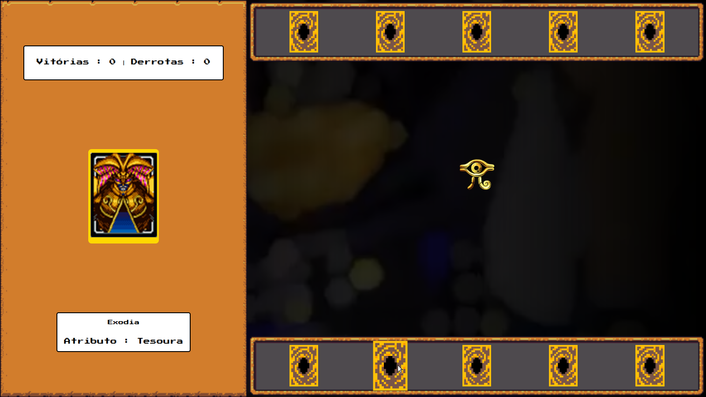

# Jokenpô do Yu-Gi-Oh じゃんけんぽん

Projeto educacional de um jogo de Jokenpô (Pedra, Papel e Tesoura) com a temática do Yu-Gi-Oh, utilizando JavaScript, CSS e HTML.

## Descrição

Este projeto foi desenvolvido com o objetivo de praticar conceitos básicos de desenvolvimento web, incluindo manipulação do DOM, JavaScript assíncrono e estilização com CSS. O jogo de Jokenpô foi personalizado com cartas temáticas do Yu-Gi-Oh, tornando a experiência mais divertida para os fãs do anime.

## Funcionalidades

- Escolha entre cartas temáticas do Yu-Gi-Oh.
- Jogue contra o computador em uma partida de Jokenpô.
- Acompanhe o placar de vitórias e derrotas.

## Como Jogar

1. Abra o arquivo `index.html` no seu navegador.
2. Escolha uma carta temática do Yu-Gi-Oh.
3. Clique no botão para jogar contra o computador.
4. Veja o resultado da partida e acompanhe o placar.

## Pré-requisitos

Nenhum pré-requisito específico é necessário. Basta abrir o arquivo `index.html` em um navegador moderno.

## Contribuição

Sinta-se à vontade para contribuir com melhorias, correções de bugs ou novas funcionalidades. Crie uma issue ou um pull request.

## Licença

Este projeto é licenciado sob a Licença MIT - veja o arquivo [LICENSE](LICENSE) para mais detalhes.
